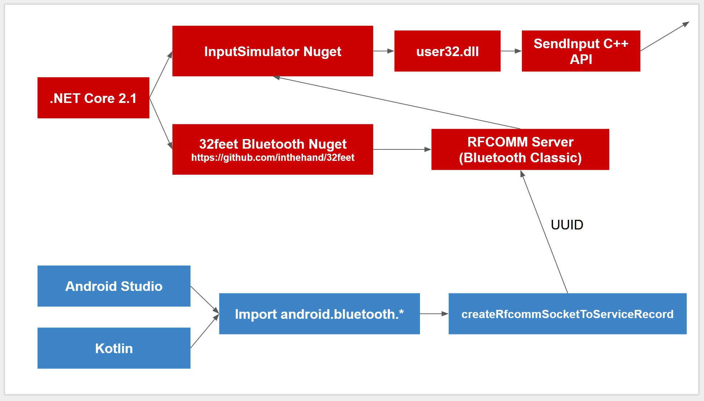

# Groove Coaster Controller (Android)

Experimental app to use your Android device as a wireless controller for playing [Groove Coaster for Steam](https://store.steampowered.com/app/744060/Groove_Coaster/)

Pair Bluetooth to your PC that is running the receiver server and Bluetooth message from Android will trigger key presses on your PC. (Personally I think keyboard is still better scoring-wise.)

Bugs/suggestions/questions : [@5argondesu](https://twitter.com/5argondesu) (Or you can fix it yourself and open a pull request!)

## How to use

1. Enable Bluetooth on your PC and your Android device.
2. Run the server .exe which you can get at http://5argon.info/gccon. It will crash if you did not turn on Bluetooth on the PC. Or you could clone this project and run debug mode with Visual Studio Code on the top folder.
3. Pair your phone to the PC manually via Bluetooth. Make sure your phone only pair to one Bluetooth device that is the PC, otherwise it might crash
4. Download Groove Coaster Controller from Google Play store which you can also find the link at http://5argon.info/gccon and open the app. You must enable Bluetooth on the phone and have paired to the PC before opening the app otherwise it will crash. (Currently I have not submit the app yet so maybe you could clone this and use Android Studio to build the APK to your device? Or just go to http://5argon.info/gccon and get the .APK to install manually using `adb install -r gccon.apk`.
5. When you do action on the screen at this moment notice that it will press escape/pause/cancel while using GCCA. Please do not charge the phone while using as it will introduce more latency via static charge. (It is the case of all mobile music games in general)

### How to navigate the menu/song selection

- Use the left booster only for confirmation. You cannot do directional before the game register the button press as a confimation.
- Instead use right booster for navigation because right booster's button press does not maps to confirmation.

### How to press escape/pause/cancel while using GCCA

- You can reach for the regular keyboard

## Input comparisons

View [the official layout documentation](https://store.steampowered.com/manual/744060).

### Keyboard layout
- (+) The key is tactile
- (+) Key orientation is flat with your hand hovering over it more resemble to arcade experience
- (-) Diagonal slide is difficult as you must do it in one hand by pressing 2 buttons
- (-) Alternating slide is difficult to do on one hand as opposed to arcade's booster which you can do it easily with one hand
- (-) Scratch note feels strange

### Regular joystick layout
- (+) The key is tactile
- (+) Diagonal slide, alternating slide, scratches feels natural
- (-) Playing in holding position is not the same motion as smashing booster at the arcade
- (-) Pressing and sliding is not on the same area as you have to reach a bit down below

### Steam Controller layout
- (+) Pressing and sliding is on the same surface
- (+) Diagonal slide, alternating slide, scratches feels natural
- (-) The key is not tactile
- (-) Playing in holding position is not the same motion as smashing booster at the arcade
- (-) Don't have money to buy a new steam controller

### This one
- (+) Diagonal slide, alternating slide, scratches feels natural
- (+) Pressing and sliding is on the same surface
- (+) Play in either holding position like Steam Controller or flat layout position like arcade. (But you might have to tape the phone)
- (-) The key is not tactile
- (-) Increased latency. About -2.5/60 ~ -3.5/60 sec more in the calibration option from what you played on the keyboard. More compensation makes ad-lib notes annoying since it is key sounded and cannot be turned off.
- (-) You might miss left side for the right side as you slide around because there is no physical separation between the areas. However the code correctly handle the case when you push at the left side and drag to the right, it will not activate the right booster and continues to drag the left booster.
- (-) Scratch note must be done in a circular motion as returning to the center deactivate the note (the real arcade booster can do left-right for scratches)

## About latency in general

Also this game seems to has serious latency problem by default, [read my review](https://steamcommunity.com/id/5argon/recommended/744060). The "game" that has less latency I mentioned in the review for example, like O2Jam and Lunatic Rave 2/Beatoraja. I wish dev could do better than this.

# For contributors

## How to build .exe with .NET Core

```
dotnet publish -c Release -r win10-x64
```

This is a self-contained build and so it will contains all of .NET Core (zipped about ~30 MB?)

## Architecture overview 



- Note that it is using Classic Bluetooth (Not Bluetooth LE)
- C# Version is 7.0 (required `async main`, local function, etc.)
- Android project uses [Kotlin](https://kotlinlang.org/) created with Android Studio 3.1.3

## Server's Bluetooth UUID (GUID)

```
0abfa6c2-384c-4844-8e9d-7fcc862b3a7d
```

## Bluetooth payload details

Android will send 1 byte (8 bits) for each booster every time there is any action on the screen. That means the server will receive 2 bytes to read from each time.

This is the data layout

```
[Escape] [Back] [Left] [Down] - [Up] [Right] [Pressed] [BoosterIndex]
```

- **Left Down Up Right** : 1 means that direction is currently active. Diagonal slide is represented by multiple of these direction bit being 1 at the same time.
- **Pressed** : 1 means the button is currently down. You cannot have the directional bit on without this as 1 as you are required to touch the screen. (But in the real Groove Coaster arcade you can push the booster without touching the button)
- **BoosterIndex** : 0 means the left booster, 1 for the right booster.
- **Escape/Back** : Reserved for pressing down or up the escape/back key. When escape is sent from the Android it will not be in pair and will be just a single byte of 1000 0000 via shaking the phone, which means it will go to left booster's variable and never to the right. (First bit is 0) Currently there is no way to send escape key from Android yet but the server can already accept it.

It is up to the server to remember the previous byte and compare with the current one to decide which key to do "key up" or "key down" or do nothing by differentiating each bit.

## Possible improvements

Here are many things that is currently not so good :

### Bug : You can use only one finger per side

If you play with your palm / several fingers per side like in the arcade the button releasing code will get confused and will fail to release the button. So for now please use only your index fingers or thumbs on holding position.

For those who wants to fix this bug : it only fails to release when playing both side actively with multiple fingers. For one side the code correctly use only the first finger touched and all other will be ignored.

### Bug : The status bar and soft key sometimes shows up and not hiding ever again

I am using `View.SYSTE_UI_FLAG_IMMERSIVE_STICKY` to auto-hide status bar and make you have to slide twice to show them up. But sometimes they show up and never hide again?


### Put better images that more resemble the real controller than stock Android UI I am using.

It is just a matter of replacing `activity_main.xml` and maybe reorder the light to come out at the top instead of as a background.

### More friendly Bluetooth pairing step

Because currently any wrong order will result in a hard crash : P Note that automatic discovery requires several additional permission and it is painful to code callbacks so I have the user pair the device manually and hard coded choosing the first Bluetooth device in the list to initiate socket connection.

At least if you press OK but there is an error connecting the program should tell you to try again instead of a crash.

### Sensitivity config start screen

If you look at `Booster.kt` you will see `companion object Constants` which contains hard coded constants. 

```kotlin
companion object Constants {
    const val edgeDistance: Float = 300f
    const val slideActivationDistance: Float = 60f
    private const val straightAngleDegree: Float = 45f
    const val halfStraightAngle: Float = straightAngleDegree / 2f
}
```

It would be great if we can move all of these as a `Booster` constructor then receive the value adjustable from welcome screen, or something.

Explanation of those values :

#### `edgeDistance`

How much pixel magnitude from center should the booster stop moving further? A value too high will make a song with alternating slide difficult to activate successively with one hand.

#### `slideActivationDistance`

From rest position how much pixel magnitude to activate the slide? When you touch the screen there would always be small movement and this value is to prevent a slide from happening every time you touch.

#### `straightAngleDegree`

In each axis you are allowed to slightly have some angle deviation for the slide to be considered straight slide, otherwise the slide is diagonal. 

For example putting 45 here means if you slide to the right you have +-22.5 degree error coverage going CW and CCW.

This is important in song select screen so that you can select the song up and down without switching page left and right.

### Scratch note improvement

As noted scratch note must be done in a circular motion as returning to the center deactivate the note (the real arcade booster can do left-right for scratches)

So we could implement some code so that a quick passing through `slideActivationDistance` = `false` does not deactive the directional bit right away. Or something...

### Server GUI + key configuration

Currently it is just a terminal .NET Core app. Not that it matters much...

But the keys mapping is currently hard coded to GC for Steam's default keyboard control key. (WASD|Space , Numpad8456|Numpad0) it might be helpful if we could change it somehow?

### USB mode

Find some way to use USB cable instead of Bluetooth. The reason that I didn't go that way despite the possible latency improvement is that programming serial port could be HELL (challenger wanted!)

### Some way to press the escape/back key

In `MainActivity.kt` you will see a commented out `socket?.outputStream?.write(1 shl 7)` which will send `1000 0000` on shaking the phone. But the key would be stuck down forever until any action to the left booster that cause `0xxx xxx` to pull it up. I feel like it is not good enough. The solution is we could implement a timer after that `1000 0000` to send the next `0000 0000` to release the key.

Also sending `1000 0000` and immediately `0000 0000` on shake for the server to read works on Note Pad but not for Groove Coaster, it will not press escape key in the game at all. I think it needs some time for the key to register before pulling up that's why we need the timer.

## Special Thanks


Originally this project is a part of my participation in [The Stupid Hackathon Thailand #2 ](https://stupidhackth.github.io/2/) #StupidHackTH. Thank you all the staffs for hosting and giving me some reason to try Kotlin! Incidentally the event was just one day before Groove Coaster for Steam release date... and so this idea was born. 

Not to mention that the event was an emotional rollercoaster as I decided to participate while having a not so good state of mind at that time. Gave up at the evening and thinking about going home and not coming back again, missed the last train busy helping other participant's project, able to pull myself back together at 2AM and finish it in time for the first morning train, go back to sleep and come back for the presentation. Pretty cool stuff...